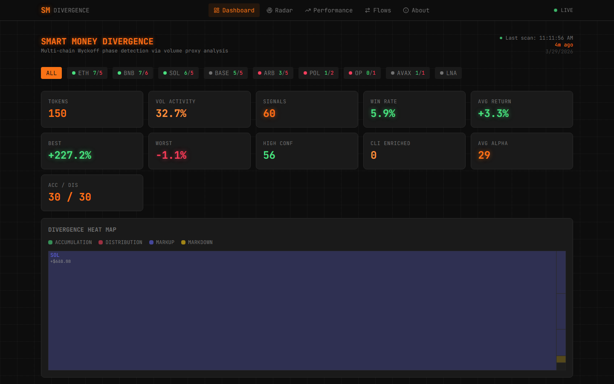
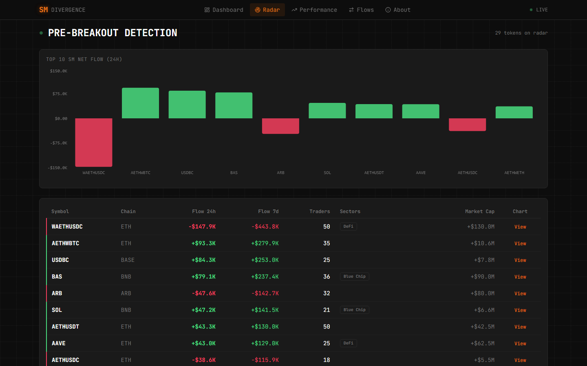
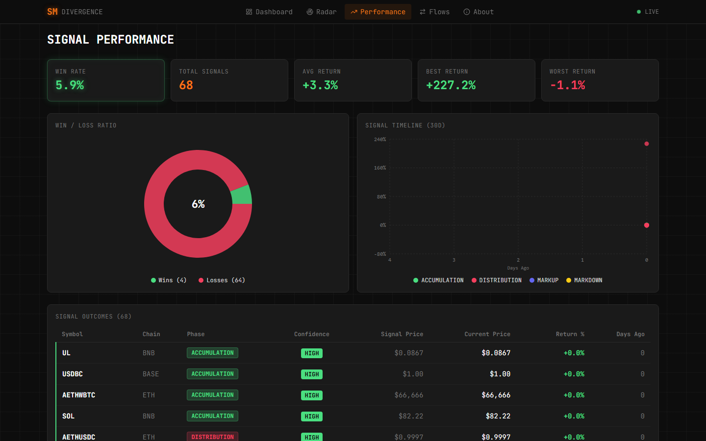
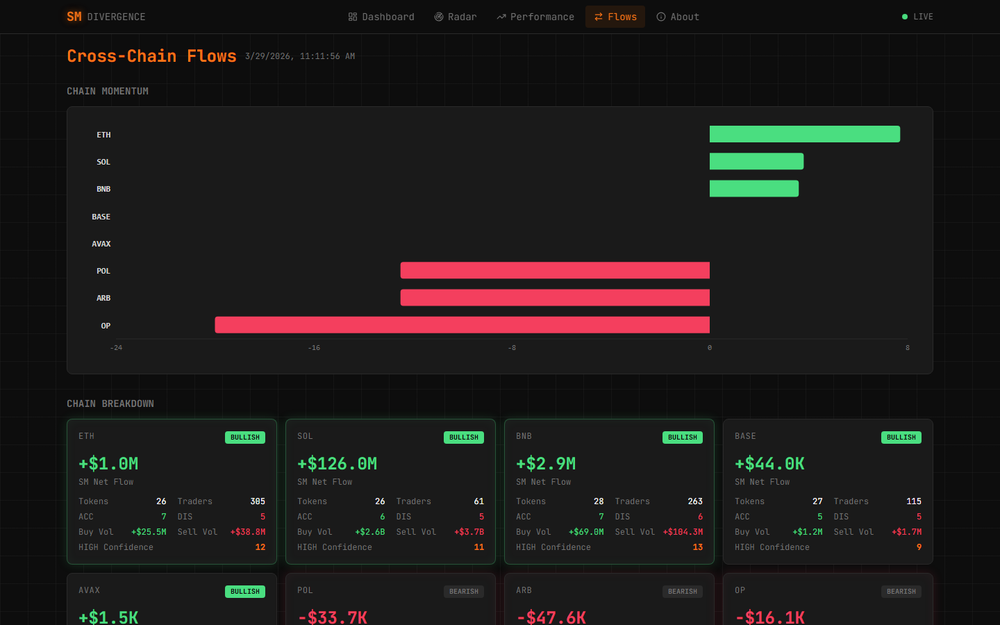
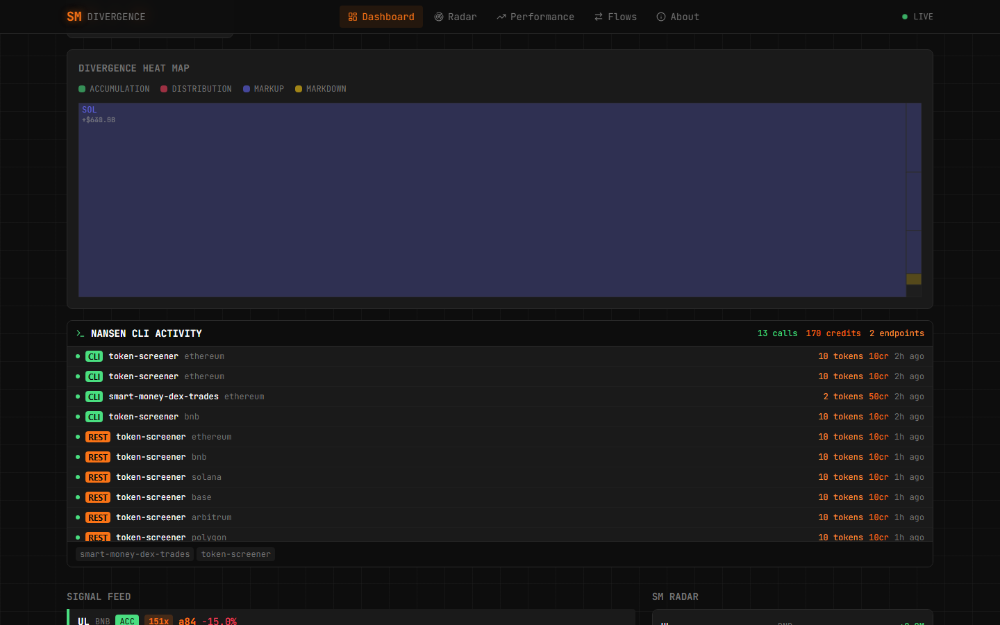

# nansen-divergence v5.3

[](https://github.com/Ridwannurudeen/nansen-divergence/actions/workflows/ci.yml)
[](https://www.python.org/downloads/)
[](https://github.com/Ridwannurudeen/nansen-divergence/blob/main/LICENSE)
[](https://nansen.gudman.xyz)

**[Live Dashboard](https://nansen.gudman.xyz)** | Multi-chain divergence scanner with volume proxy analysis, Wyckoff phase classification, signal backtesting, and Alpha Score ranking.

Built on the [Nansen CLI](https://docs.nansen.ai/nansen-cli/overview) + MCP. Submitted for the **Nansen CLI Hackathon (Week 2)**.

> **Hackathon context**: This project extends the Nansen CLI into a full trading intelligence platform. It discovers tokens via Nansen's MCP `general_search` (zero credits), derives institutional activity signals from volume/price data, classifies Wyckoff phases, and tracks signal outcomes over time — all self-hosted with a real-time Next.js dashboard.

## Screenshots

| Dashboard | Radar |
|:---------:|:-----:|
|  |  |

| Performance | Cross-Chain Flows |
|:-----------:|:-----------------:|
|  |  |

| CLI Activity |
|:------------:|
|  |

## Demo

https://github.com/Ridwannurudeen/nansen-divergence/raw/main/docs/screenshots/dashboard-demo.mp4

## What It Does

Scans **8 blockchains** every 5 minutes and classifies tokens into **Wyckoff market phases** based on the divergence between **volume-derived activity signals** and price movement:

| Phase | SM Flow | Price | Signal |
|-------|---------|-------|--------|
| **ACCUMULATION** | Buying | Falling | Bullish divergence — SM loading while price drops |
| **DISTRIBUTION** | Selling | Rising | Bearish divergence — SM exiting into strength |
| **MARKUP** | Buying | Rising | Trend confirmed — momentum aligned |
| **MARKDOWN** | Selling | Falling | Capitulation |

## Architecture

```
                    Nansen MCP (general_search)
                          0 credits
                              |
                    ┌─────────┼─────────┐
                    v         v         v
               Token       Price      Entity
              Discovery   Snapshots   Sectors
                    └─────────┼─────────┘
                              v
                  ┌───────────────────────┐
                  │   CLI Enrichment       │
                  │   (ETH + BNB, ~12cr)  │
                  │                       │
                  │  token screener → mcap │
                  │  SM netflow → real SM  │
                  └───────────┬───────────┘
                              v
                  ┌───────────────────────┐
                  │    Volume Proxy        │
                  │    Engine (Python)     │
                  │                       │
                  │  Vol/MCap → Activity  │
                  │  RelVol → Anomaly     │
                  │  Divergence → Phase   │
                  │  Alpha Score (0-100)  │
                  └───────────┬───────────┘
                              │
                    ┌─────────┼─────────┐
                    v         v         v
                 CLI       FastAPI    Next.js
                Output     (8010)    Dashboard
                              │       (3010)
                              └───┬───┘
                                  v
                  Signal History (SQLite)
                  + Outcome Backtesting
                                  │
                                  v
                           Docker Compose
                           + nginx reverse proxy
                                  │
                                  v
                         https://nansen.gudman.xyz
```

### Hybrid Pipeline

The scanner uses a **hybrid approach**: MCP discovers tokens at zero cost across all 8 chains, then the **Nansen CLI enriches** top tokens on Ethereum and BNB Chain with real smart money data:

1. **MCP Discovery** (0 credits) — `general_search` finds 100+ tokens across 8 chains
2. **CLI Enrichment** (~12 credits/cycle) — `token screener` + `smart-money netflow` override volume-proxy data with real market cap, price, and SM flow for ETH/BNB tokens
3. **Volume Proxy** (0 credits) — remaining tokens scored via Vol/MCap ratio and relative volume
4. **Divergence Engine** — Wyckoff phase classification + Alpha Score ranking

Tokens enriched with real CLI data show a green **CLI** badge on the dashboard; volume-proxy tokens show **VP**.

## Dashboard Pages

| Page | What It Shows |
|------|---------------|
| **Dashboard** | Heat map, signal feed, metric cards, token watchlist, full token table with Alpha Score bars |
| **Radar** | High-activity divergent tokens — volume anomalies before the crowd |
| **Performance** | Win/loss donut, signal timeline scatter, outcome backtesting over 30 days |
| **Flows** | Chain momentum chart, per-chain breakdown cards, sector rotation table |
| **Token Deep Dive** | Per-token flow intelligence, top buyers/sellers, Nansen Score, wallet profiles |

## Features

**Hybrid Pipeline (MCP + CLI)**
- MCP `general_search` discovers 100+ tokens across 8 chains (0 credits)
- **CLI enrichment** overrides ETH/BNB tokens with real screener + SM netflow data (~12 credits/30min)
- SQLite price history tracks real price changes over time
- Vol/MCap ratio + relative volume → institutional activity proxy (remaining tokens)
- Price-volume divergence → accumulation/distribution detection
- Dashboard badges show data source: **CLI** (green) or **VP** (gray)

**Divergence Engine**
- Multi-factor Alpha Score (0-100): flow magnitude (40%), price movement (25%), wallet diversity (20%), holdings conviction (15%)
- Log-scaled normalization prevents large-cap dominance
- Confidence tiers: HIGH / MEDIUM / LOW
- Narrative generation from volume signals and price action

**Signal Backtesting**
- Every scan persisted to SQLite signal history
- Past ACCUMULATION/DISTRIBUTION signals validated against current prices
- Win/loss tracking, return distributions, performance dashboards
- Zero extra API calls — uses stored vs current price comparison

**CLI**
- 8-chain scan with Wyckoff classification
- Deep dive per token (flow intelligence, buyers/sellers, wallet profiles)
- HTML reports, JSON output, Telegram alerts, watch mode
- Signal history with SQLite persistence and outcome validation

**CLI Activity Feed**
- Live terminal-style feed showing every Nansen CLI/REST call
- Tracks endpoint, chain, credits, token count, source (CLI/REST)
- Aggregate stats: total calls, credits used, endpoints active

**Dashboard (Next.js)**
- Terminal-style dark UI (JetBrains Mono, orange accent)
- Token watchlist with localStorage persistence
- Recharts visualizations (treemap, bar charts, pie, scatter)
- Responsive mobile-first design with card layouts
- Accessible (ARIA labels, focus-visible, reduced-motion support)
- SWR auto-refresh every 60 seconds

## What Sets This Apart

| Feature | Raw Nansen CLI | nansen-divergence |
|---------|---------------|-------------------|
| Multi-chain scanning | Manual, one chain at a time | 8 chains in one sweep |
| Wyckoff classification | Not available | Automatic phase + confidence |
| Alpha Score ranking | Not available | 4-factor weighted score (0-100) |
| Signal backtesting | Not available | SQLite history + outcome tracking |
| Volume proxy analysis | Not available | Vol/MCap + relative volume signals |
| Token watchlist | Not available | Client-side star + persist |
| Real-time dashboard | Not available | Next.js terminal UI, 60s refresh |
| Real SM enrichment | N/A | CLI screener + netflow → real data on ETH/BNB |
| CLI activity feed | N/A | Live feed of every CLI/REST call with stats |
| 3-tier API fallback | N/A | CLI binary → REST API → MCP (automatic) |
| Zero-credit mode | N/A | MCP general_search (unlimited) |
| Self-hosted | N/A | Docker Compose + nginx |

## Quick Start

### CLI

```bash
# Prerequisites
npm i -g nansen-cli
nansen login

# Install
git clone https://github.com/Ridwannurudeen/nansen-divergence.git
cd nansen-divergence
pip install -e .

# Full 8-chain scan
nansen-divergence scan

# Specific chains + deep dive
nansen-divergence scan --chains ethereum,bnb,solana --auto-dive 3

# JSON output
nansen-divergence scan --json --chains bnb --limit 5

# HTML report
nansen-divergence scan --chains bnb --limit 10 --html report.html

# Watch mode + Telegram alerts
nansen-divergence scan --chains bnb --limit 5 --watch 10 --telegram
```

### Deep Dive

```bash
nansen-divergence deep --chain ethereum --token 0x7fc66500c84a76ad7e9c93437bfc5ac33e2ddae9
```

### REST API Mode

```bash
export NANSEN_API_KEY="your-api-key"
nansen-divergence scan --chains bnb --limit 5
# Nansen functions auto-switch to REST API when key is set
```

### Self-Host (Docker)

```bash
cp .env.example .env
# Add NANSEN_MCP_KEY to .env

docker compose up -d
# API at :8010, Dashboard at :3010
# Add nginx reverse proxy for HTTPS
```

## Nansen CLI / API Usage

| Command | Purpose | Active in Prod |
|---------|---------|:--------------:|
| `research token screener` | Token list + price + netflow | **YES** (CLI enrichment) |
| `research smart-money netflow` | SM net flow per token | **YES** (CLI enrichment) |
| `research smart-money dex-trades` | Individual SM wallet trades | CLI scan mode |
| `research smart-money holdings` | SM positions + 24h change | CLI scan mode |
| `research token flow-intelligence` | Flow by wallet label | Deep dive |
| `research token who-bought-sold` | Named buyers/sellers | Deep dive |
| `research token indicators` | Nansen Score | Deep dive |
| `research profiler labels` | Wallet labels | Deep dive |
| `research profiler pnl-summary` | Wallet PnL history | Deep dive |

## Scoring Algorithm

```
flow_score       = log10(|flow| + 1) / log10(market_cap)   # 0-1
price_score      = min(|price_change| * 5, 1.0)             # 10% = 0.5
diversity_score  = min(trader_count / 10, 1.0)               # more wallets = stronger
conviction_score = holdings change agreeing with flow         # 0-1

alpha_score = (0.40 * flow + 0.25 * price + 0.20 * diversity + 0.15 * conviction) * 100

Confidence:
  HIGH   = 3+ signals active, strength >= 0.4
  MEDIUM = 2+ signals active, strength >= 0.2
  LOW    = everything else
```

## Testing

```bash
pip install -e ".[test]"
pytest tests/ api/tests/ -v
# 165 tests across engine, API, scoring, alerts, history, and reports
```

## Tech Stack

| Layer | Technology |
|-------|-----------|
| Engine | Python 3.12, Rich |
| API | FastAPI, Uvicorn, APScheduler |
| Dashboard | Next.js 16, React, Tailwind CSS v4, Recharts, SWR |
| Data | Nansen MCP + REST API, SQLite (history + prices) |
| Deploy | Docker Compose, nginx, Let's Encrypt |
| CI | GitHub Actions (pytest + ruff) |

## Project Stats

- **8,800+** lines of code across Python engine, FastAPI API, and Next.js dashboard
- **165** automated tests (divergence, history, scoring, alerts, API, reports)
- **8** blockchain chains scanned every 5 minutes
- **9** Nansen API endpoints integrated (CLI + MCP)
- **5** dashboard pages with responsive mobile layouts
- **13+** verified Nansen API calls across 8 chains and 4 endpoints
- **3-tier** API fallback: CLI binary → REST API → MCP (automatic)

## License

MIT
